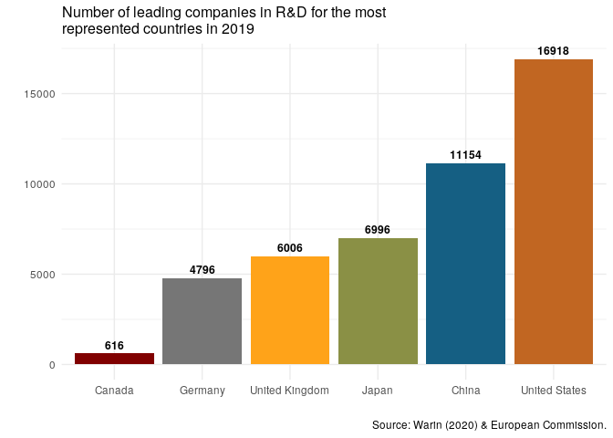

<!-- README.md is generated from README.Rmd. Please edit that file -->

# iriR

<!-- badges: start -->

[](https://travis-ci.org/warint/iriR)
[](https://ci.appveyor.com/project/warint/iriR)
<!-- badges: end -->

## Overview

The IRI Scoreboard for data on innovation, managed by the European
Commission, lists Research and Development investments made by the
world’s 1,000 top investor companies.This scientific project carried
out within the Directorate B: Growth and Innovation, one of the seven
scientific institutes of the European Commission’s Joint Research Centre
(JRC).

The IRI aims at providing robust data and analysis on the contribution
of private-sector R\&D to sustainable competitiveness and “prosperity”
in the EU. With iriR, we want to make easily available the IRI’s data
and modestly help the European Commission in achieving its goals, such
as open the data to EU policy-makers, academia, and other institutional
and economic actors.

Through our R package, people can see the six parameters that composed
the global IRI’data on R\&D : Country, Year, Company’s name, Industry,
Indicator and Compaany’s rank.

To see a definition of the indicators, please visit this
[page](https://iri.jrc.ec.europa.eu/sites/default/files/2019-12/SB2019_Final_18Dec2019_0.pdf).
See below to have access through iriR to the whole list of
indicators,industries, companies and countries.

For more information about IRI and follow the work of the European
Comission, please visit this [page](https://iri.jrc.ec.europa.eu/home/).

## Installation

You can install the current development version of ‘iriR’ with devtools:

``` r
devtools::install_github("warint/iriR")
```

## How-To

### Step 1: Getting the country’s ISO code

A user needs to enter the ISO code of a country. To have access to this
code, the following function provides this information.

``` r
irir_country() # A list of all countries will be produced

irir_country(country = "Canada") # The ISO code for Canada will be produced

irir_country("Canada") # The ISO code for Canada will be produced
```

### Step 2: Getting the indicator’s code

A user needs to enter the code of the desired indicator. To do so, the
following function provides access to all the indicators of interest.

``` r
irir_indicator() # A list of all indicators will be produced

irir_indicator(indicators = "sales") # A list with all the variables including "sales" will be produced

irir_indicator("sales") # A list with all the variables including "sales" will be produced
```

### Step 3: Getting the company’ name

A user needs to enter the name of the desired company. To do so, the
following function provides access to all the companies of interest.

``` r
irir_company() # A list of all companies will be produced

irir_company(company = "Samsung") # A list with all the variables including "Samsung" will be produced

irir_indicator("Samsung") # A list with all the variables including "Samsung" will be produced
```

### Step 4: Getting the industry’ name

A user needs to enter the name of the desired industry. To do so, the
following function provides access to all the industries of interest.

``` r
irir_industry() # A list of all companies will be produced

irir_industry(industry = "Automobile") # A list with all the variables including "Automobile" will be produced

irir_industry("Automobile")# A list with all the variables including "Automobile" will be produced
```

### Step 5: Getting the data

Once the user knows all the arguments, s.he can collect the data in a
very easy way through this function:

``` r
irir_data(country = "USA", years = "2018", indicators = "RD.euro", company = "FORD MOTOR", industry = "Automobiles & Parts", rank = 14)  # It generates a data frame of the overall IRI data for American company "FORD MOTOR" in 2018.

irir_data(country=c("USA", "FRA"), years="2018",) # It generates a data frame of all the companies data from all the industries for the USA and France in 2018.

irir_data(years = "2018") # It generates a data frame of all the companies data for from all the industries for all the countries in 2018.

irir_data() # It generates a data frame of the complete dataset
```

## Create visuals

Country set to Canada by default, if no country code but argument, only
top 5.

### Barchart on Top 5 countries for number of leading companies in R\&D

Country set to Canada by default, if there is no country code but an
empty argument, only top 5 like as below.

``` r
irir_visual(country = "" ,chart = "bar_1")
```



If the argument “country” is missing, Canada will be included by default

``` r

irir_visual(chart = "bar_1")
```


However, you can choose the country of your choice to be included.

``` r
irir_visual(country = "FRA",  chart = "bar_1")
```


bar123 line6 point1

### Cite ‘iriR’

``` r
@article{Warin2020,
author = "Thierry Warin",
title = "{iriR: iriR: A R Package for the EU Industrial Research and Industry Scoreboard}",
year = "2020",
month = "1",
url = "https://figshare.com/articles/iriR_Client_for_the_EU_Industrial_Research_and_Industry_Scoreboard/11774640",
doi = "10.6084/m9.figshare.11774640"
}
```

##### Acknowledgment of Source according to Creative Commons Attribution 4.0 International (CC BY 4.0) licence.

As it is stated, The European Commission’s reuse policy is implemented
by the Commission Decision of 12 December 2011 on the reuse of
Commission
[documents](https://eur-lex.europa.eu/legal-content/EN/TXT/?uri=CELEX:32011D0833).

Unless otherwise indicated (e.g. in individual copyright notices),
content and data owned by the EU is licensed under the Creative Commons
Attribution 4.0 International (CC BY 4.0)
[licence](https://creativecommons.org/licenses/by/4.0/).

Reuse is allowed, provided appropriate credit is given and changes are
indicated.

### Acknowledgments

The author would like to thank the Center for Interuniversity Research
and Analysis of Organizations (CIRANO, Montreal) for its support, as
well as Thibault Senegas, Marine Leroi and Martin Paquette. The usual
caveats apply.
